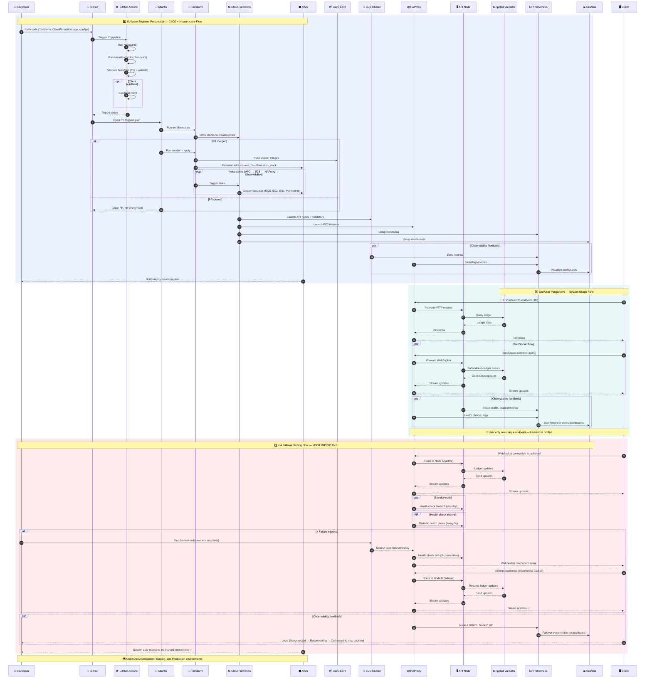
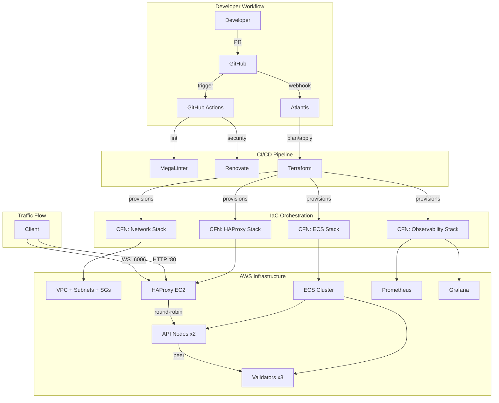

# AX Ripple Network

[](../../actions/workflows/ci.yml)
[](../../actions/workflows/bootstrap.yml)
[](LICENSE)

> Enterprise-grade XRP Ledger infrastructure on AWS using a hybrid IaC architecture (Terraform → CloudFormation) with HAProxy load balancing, ECS-based rippled nodes, and full observability.

---

## 🧠 Architecture

```
Terraform is used as the orchestration layer for infrastructure lifecycle
and team workflows (via Atlantis), while CloudFormation is used for
AWS-native resource provisioning to align with AWS best practices
and enable modular stack reuse.
```

### End-to-End Architecture Flow: Engineering, User, and Failover Perspectives

> The following sequence diagram covers **three perspectives**: the software engineer's CI/CD & infra flow, the end-user's runtime traffic flow, and the HA failover testing flow — the most critical proof point for this architecture.



### High-Level Infrastructure Overview



## 📁 Repository Structure

```
ax-ripple-network/
├── 001_app/                        # Application code
│   ├── client/
│   │   ├── package.json            # Node.js dependencies
│   │   ├── client.js               # WebSocket failover test client
│   │   └── .env.example            # Environment variable template
│   └── docker/
│       ├── Dockerfile.validator    # Docker image for validator nodes
│       └── Dockerfile.api-node     # Docker image for API nodes
│
├── 002_configs/                    # Runtime configuration files
│   ├── haproxy/
│   │   └── haproxy.cfg             # HAProxy load balancer config
│   └── rippled/
│       ├── validator.cfg           # Rippled validator node config
│       └── api-node.cfg            # Rippled API node config
│
├── 003_scripts/                    # Operational scripts
│   ├── bootstrap-backend.sh        # Create S3/DynamoDB for TF state
│   ├── validate-infra.sh           # Validate all infrastructure
│   └── failover-test.sh            # End-to-end failover test
│
├── 004_terraform/                  # Terraform orchestration layer (modular)
│   ├── shared-infra/               # Shared infrastructure (deploy FIRST)
│   │   ├── main.tf                 # Network + ECS cluster CFN stacks
│   │   ├── variables.tf            # region, environment, vpc_cidr
│   │   ├── outputs.tf              # VPC, subnets, SGs, cluster ARN
│   │   ├── providers.tf
│   │   ├── backend.tf              # S3 state: shared-infra/terraform.tfstate
│   │   ├── environments/
│   │   │   ├── dev.tfvars
│   │   │   └── prod.tfvars
│   │   └── cfn/
│   │       ├── network.yaml        # VPC, subnets, security groups
│   │       └── ecs-cluster.yaml    # Shared ECS cluster, execution role, service discovery
│   │
│   └── services/
│       ├── ax-ripple-network/      # Ripple service (validators, API, HAProxy, observability)
│       │   ├── main.tf             # Reads shared-infra state, deploys service CFN stacks
│       │   ├── variables.tf        # images, counts, haproxy, observability
│       │   ├── outputs.tf
│       │   ├── providers.tf
│       │   ├── backend.tf          # S3 state: services/ax-ripple-network/terraform.tfstate
│       │   ├── environments/
│       │   │   ├── dev.tfvars
│       │   │   └── prod.tfvars
│       │   └── cfn/
│       │       ├── ecs-services.yaml   # Task defs, ECS services, ECR repos
│       │       ├── haproxy.yaml        # HAProxy EC2 ASG
│       │       └── observability.yaml  # Prometheus + Grafana
│       │
│       └── atlantis/               # Atlantis service (Terraform PR automation)
│           ├── main.tf             # Reads shared-infra state, deploys Atlantis
│           ├── variables.tf        # image, GitHub secrets, repo allowlist
│           ├── outputs.tf
│           ├── providers.tf
│           ├── backend.tf          # S3 state: services/atlantis/terraform.tfstate
│           ├── environments/
│           │   ├── dev.tfvars
│           │   └── prod.tfvars
│           └── cfn/
│               └── atlantis.yaml   # Atlantis ECS task, service, IAM
│
├── .github/workflows/              # CI/CD pipelines
│   └── ci.yml                      # PR validation + Docker build & push to ECR
│
├── atlantis.yaml                   # Atlantis PR automation config
├── renovate.json                   # Dependency update bot config
├── .mega-linter.yml                # Multi-language linter config
├── .gitignore
├── LICENSE
└── README.md
```

## 🚀 Quick Start

### Prerequisites

| Tool | Version | Purpose |
|------|---------|---------|
| Terraform | >= 1.5.0 | IaC orchestration |
| AWS CLI | v2 | AWS access |
| Node.js | >= 18 | Client application |
| cfn-lint | latest | CloudFormation validation |

### 1. One-Time AWS Setup

```bash
# 1a. Create OIDC identity provider for GitHub Actions
#     (allows GitHub runners to assume IAM roles without static keys)
aws iam create-open-id-connect-provider \
  --url "https://token.actions.githubusercontent.com" \
  --client-id-list "sts.amazonaws.com" \
  --thumbprint-list "6938fd4d98bab03faadb97b34396831e3780aea1"

# 1b. Create IAM role for GitHub Actions (store ARN as GitHub org secret: AWS_ROLE_ARN)

# 1c. Create Secrets Manager entries for Atlantis
aws secretsmanager create-secret --name atlantis/github-token \
  --secret-string "ghp_xxxxxxxxxxxx"
aws secretsmanager create-secret --name atlantis/webhook-secret \
  --secret-string "$(openssl rand -hex 32)"

# 1d. Bootstrap Terraform state backend (S3 + DynamoDB)
chmod +x 003_scripts/bootstrap-backend.sh
./003_scripts/bootstrap-backend.sh
```

### 2. Set GitHub Org Secret

```
GitHub → Settings → Secrets → Actions → New organization secret
  Name:  AWS_ROLE_ARN
  Value: arn:aws:iam::<ACCOUNT_ID>:role/github-actions-role
```

### 3. Run Bootstrap Workflow (one-time)

```
GitHub → Actions → "Bootstrap Infrastructure" → Run workflow
  Environment: dev
  Deploy AX Ripple Network: ✅
```

This deploys: **shared-infra → Atlantis → AX Ripple Network** in order.
After this, Atlantis is live and manages all future changes via PRs.

### 4. Validate & Test

```bash
# Validate infrastructure
chmod +x 003_scripts/validate-infra.sh
./003_scripts/validate-infra.sh

# Test WebSocket client
cd 001_app/client
cp .env.example .env
# Update HAPROXY_HOST with HAProxy IP from Terraform outputs
npm install && npm start

# Run failover test
chmod +x 003_scripts/failover-test.sh
./003_scripts/failover-test.sh
```

## 🔧 How It Works

### Terraform → CloudFormation Pattern

Terraform acts as the **orchestration layer**, while CloudFormation handles **AWS-native provisioning**. Services consume shared infrastructure via `terraform_remote_state`:

```hcl
# Services read shared infra outputs
data "terraform_remote_state" "shared" {
  backend = "s3"
  config  = { bucket = "ax-ripple-network-terraform-state", key = "shared-infra/terraform.tfstate" }
}

# Then deploy into the shared ECS cluster
resource "aws_cloudformation_stack" "ecs_services" {
  template_body = file("${path.module}/cfn/ecs-services.yaml")
  parameters    = { ECSClusterArn = data.terraform_remote_state.shared.outputs.ecs_cluster_arn }
}
```

### Infrastructure Stacks

**Shared Infrastructure** (deployed once):

| Stack | Resources | Dependencies |
|-------|-----------|-------------|
| **Network** | VPC, Subnets (2 public + 2 private), IGW, NAT GW, Security Groups | None |
| **ECS Cluster** | Shared Fargate cluster, task execution role, service discovery namespace | Network |

**Services** (deployed independently, into shared infra):

| Stack | Resources | Dependencies |
|-------|-----------|-------------|
| **ECS Services** | Validator tasks (3), API tasks (2), ECR repos, service discovery entries | Shared Infra |
| **HAProxy** | EC2 ASG, Launch Template, HAProxy config, Elastic IP | Shared Infra, ECS Services |
| **Observability** | Prometheus, Grafana, EFS storage | Shared Infra, ECS Services, HAProxy |
| **Atlantis** | Atlantis ECS task, IAM role (TF state + CFN access), service discovery | Shared Infra |

### HAProxy Load Balancing

```
Client → HAProxy :80  (HTTP)  → rippled API nodes :5005 (JSON-RPC)
Client → HAProxy :6006 (WS)   → rippled API nodes :6006 (WebSocket)
```

- **Round-robin** load balancing across API nodes
- **Health checks** every 5s (3 failures = down, 2 successes = up)
- **Sticky sessions** for WebSocket connections
- **Stats dashboard** at `:8404/stats`

### CI/CD Pipeline

```
PR Opened → GitHub Actions CI:
  ├── MegaLinter, Hadolint, cfn-lint, ShellCheck, Node.js syntax
  ├── Terraform fmt + validate (all 3 modules)
  └── Docker Build & Push to ECR (tagged with PR commit SHA)
        ↓ images exist in ECR
PR Opened → Atlantis (auto-plan, references the ECR images):
  ├── atlantis plan -p shared-infra
  ├── atlantis plan -p ax-ripple-network
  └── atlantis plan -p atlantis

PR Approved → Developer comments:
  ├── atlantis apply -p shared-infra         (deploy FIRST)
  ├── atlantis apply -p ax-ripple-network    (after shared-infra)
  └── atlantis apply -p atlantis             (after shared-infra)

PR Merged → GitHub Actions CI:
  ├── Promote SHA-tagged images to :latest in ECR
  └── Create GitHub Release v1.0.X (auto-increment, max X=9)
```

## 🧪 Post-Deployment Flows

After infrastructure is deployed to AWS ECS, three scripts validate and demonstrate the system:

### 1. Test Flow — Validate the Network (`test-flow.sh`)

Non-interactive. Checks every component is healthy.

```bash
export HAPROXY_PUBLIC_IP=<ip>   # or let it read from Terraform outputs
./003_scripts/test-flow.sh
```

| Phase | What it checks |
|-------|---------------|
| 1. ECS Cluster | Cluster ACTIVE, API service running ≥ 2 tasks |
| 2. Validators | Peers visible, validation quorum set |
| 3. API Nodes | HTTP (JSON-RPC :80) responds, WebSocket (:6006) receives ledger event |
| 4. Ledger Progression | Validated ledger index increases over 10s (consensus working) |
| 5. HAProxy Routing | 6 HTTP requests show round-robin across ≥ 2 backends |
| 6. HAProxy Stats | Stats dashboard accessible, backend status UP |

### 2. Demo Flow — Full End-to-End (`demo-flow.sh`)

Interactive (pauses between steps for observation). Maps **1:1** to the task's "Recommended Demo Flow":

```bash
export HAPROXY_PUBLIC_IP=<ip>
export ECS_CLUSTER_NAME=<cluster>
export API_SERVICE_NAME=<service>
./003_scripts/demo-flow.sh
```

| Step | Task Requirement | What it does |
|------|-----------------|--------------|
| 1 | "Start the private network and confirm ledger progression" | Queries `server_info`, checks ledger index grows over 8s |
| 2 | "Show that HTTP requests succeed through the single public endpoint" | Sends 4 HTTP POST requests, shows round-robin across backends |
| 3 | "Start the subscriber client against the single public WebSocket endpoint" | Starts `client.js`, waits 20s, shows validated ledger events in log |
| 4 | "Stop one backend rippled API/proxy node" | `aws ecs stop-task` on one API node, waits 30s |
| 5 | "Show that HTTP continues to work through the same public endpoint" | HTTP POST to same `:80` endpoint → still responds |
| 6 | "Show that the WebSocket client detects interruption, reconnects, and resumes" | Client log shows: disconnect → reconnect → BACKEND SWITCH → resumed ledger events |
| 7 | Switch proof | HAProxy stats before/after + client log key events |

### 3. Failover Test — Automated Pass/Fail (`failover-test.sh`)

Fully automated (CI-friendly). Returns exit code 0/1.

```bash
export HAPROXY_PUBLIC_IP=<ip>
export ECS_CLUSTER_NAME=<cluster>
export API_SERVICE_NAME=<service>
./003_scripts/failover-test.sh
```

| Phase | Acceptance Criterion | Check |
|-------|---------------------|-------|
| 1 | Infrastructure running | HTTP responds, ≥ 2 API tasks |
| 2 | Client works | WebSocket connects, receives validated ledger events |
| 3 | Pre-failover state | HAProxy stats captured |
| 4 | **Failure injected** | One ECS API task stopped |
| 5 | HTTP continues | Same `:80` endpoint still responds 200 |
| 6 | WebSocket recovers | Disconnect detected → reconnected → new ledger events |
| 7 | **Switch proof** | Client log shows `BACKEND SWITCH DETECTED` + HAProxy stats show `DOWN` |
| 8 | Results | Pass/fail count, full summary |

### Expected Output During Failover

**Client log (`/tmp/ax-ripple-failover-test.log`):**
```json
{"timestamp":"...","level":"INFO","message":"📒 Validated ledger","ledgerIndex":42,"backendNode":"api-1"}
{"timestamp":"...","level":"INFO","message":"📒 Validated ledger","ledgerIndex":43,"backendNode":"api-1"}
{"timestamp":"...","level":"WARN","message":"❌ WebSocket disconnected","code":1006}
{"timestamp":"...","level":"INFO","message":"⏳ Scheduling reconnect","attempt":1,"delayMs":2000}
{"timestamp":"...","level":"INFO","message":"🔁 Reconnecting...","attempt":1}
{"timestamp":"...","level":"INFO","message":"✅ WebSocket connection established"}
{"timestamp":"...","level":"INFO","message":"🔄 BACKEND SWITCH DETECTED","previousNode":"api-1","currentNode":"api-2"}
{"timestamp":"...","level":"INFO","message":"📡 Connected to backend node","hostid":"api-2"}
{"timestamp":"...","level":"INFO","message":"📒 Validated ledger","ledgerIndex":44,"backendNode":"api-2"}
{"timestamp":"...","level":"INFO","message":"📒 Validated ledger","ledgerIndex":45,"backendNode":"api-2"}
```

**HAProxy stats (before/after):**
```
Before:  rippled_http/api-1: UP   rippled_http/api-2: UP
After:   rippled_http/api-1: DOWN rippled_http/api-2: UP
```

## 📊 Observability

| Component | Port | Purpose |
|-----------|------|---------|
| **Prometheus** | 9090 | Metrics collection |
| **Grafana** | 3000 | Dashboards (admin/admin) |
| **HAProxy Stats** | 8404 | Load balancer metrics |

## ⚖️ Tradeoffs

### Why Terraform + CloudFormation?
- ✅ Separation of orchestration vs provisioning
- ✅ Reusable CFN stacks across projects
- ❌ Added complexity / double IaC layer

### Why ECS over EKS?
- 💰 Lower cost (no control plane fees)
- ⚡ Faster setup, sufficient for PoC

### Why HAProxy over ALB?
- 🔧 Better control for WebSocket failover
- 📝 Clearer logging (critical for failover demo)

## 🔒 Security

- Validator seeds injected via **AWS Secrets Manager** (never committed)
- Private subnets for validators (no public IP)
- OIDC for GitHub Actions → AWS (no long-lived credentials)
- S3 state bucket: encrypted, public access blocked, DynamoDB locking

## 📝 License

MIT — see [LICENSE](LICENSE)

